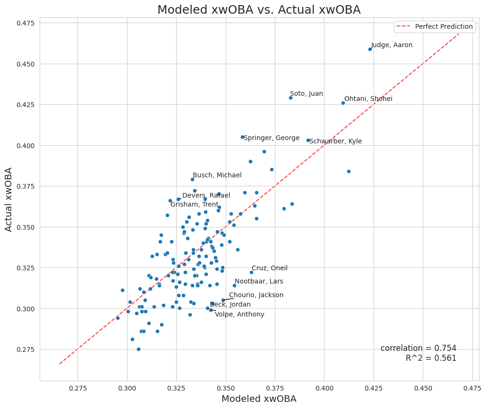

# MLB Hitting Skills Model: Predicting xwOBA from Component Skills

This repository contains a machine learning project that predicts a baseball player's future offensive performance using a curated set of underlying "component" hitting skills, rather than traditional batted ball outcome stats.


*A scatter plot showing the model's strong correlation between predicted (modeled) and actual xwOBA for the 2025 season.*

---

## Project Goal

This project aims to build and evaluate a machine learning model that predicts a baseball player's future offensive performance, measured by **xwOBA** (Expected Weighted On-Base Average).

The central hypothesis is that a model built on a curated set of underlying hitting "component skills" (like bat speed, plate discipline, and bat control) can be as predictive as more comprehensive statcast stats that take into account batted ball outcomes like launch angle and exit velocity.

---

## Key Findings

The final Random Forest model successfully predicted 2025 `xwOBA` with a **Root Mean Squared Error (RMSE) of 0.0199**.

This result proved the initial hypothesis, as the model was approximately **7% more accurate** than the best-performing single-feature baseline model (which used `barrel_batted_rate`). The comprehensive analysis showed that the model is not only accurate but also robust and unbiased in its predictions.

---

## Process Overview

The notebook follows a standard data science workflow:

1.  **Data Loading & Inspection:** The dataset, sourced from Baseball Savant, contains aggregated player-season data from 2023 to 2025.
2.  **Feature Selection & Engineering:** After analyzing the available metrics, a final set of 7 features was selected to represent four key component skills. A new `discipline_ratio` feature was engineered to better capture plate discipline.
3.  **Model Training:** A Random Forest Regressor was trained on data from the 2023 and 2024 seasons.
4.  **Model Evaluation:** The model's ability to predict future performance was tested on unseen data from the 2025 season.
5.  **Baseline Comparison:** The final model's performance was benchmarked against simpler, single-feature models to validate its effectiveness.

---

## Getting Started

### Prerequisites

This project uses Python 3.9+. All required libraries are listed in the `requirements.txt` file.

### Installation

1.  Clone the repository to your local machine:
    ```bash
    git clone https://github.com/your-username/your-repo-name.git
    cd your-repo-name
    ```

2.  Install the necessary packages:
    ```bash
    pip install -r requirements.txt
    ```

### Usage

To explore the analysis and model, open and run the Jupyter Notebook:
```bash
jupyter notebook hitting_skill_ML.ipynb
